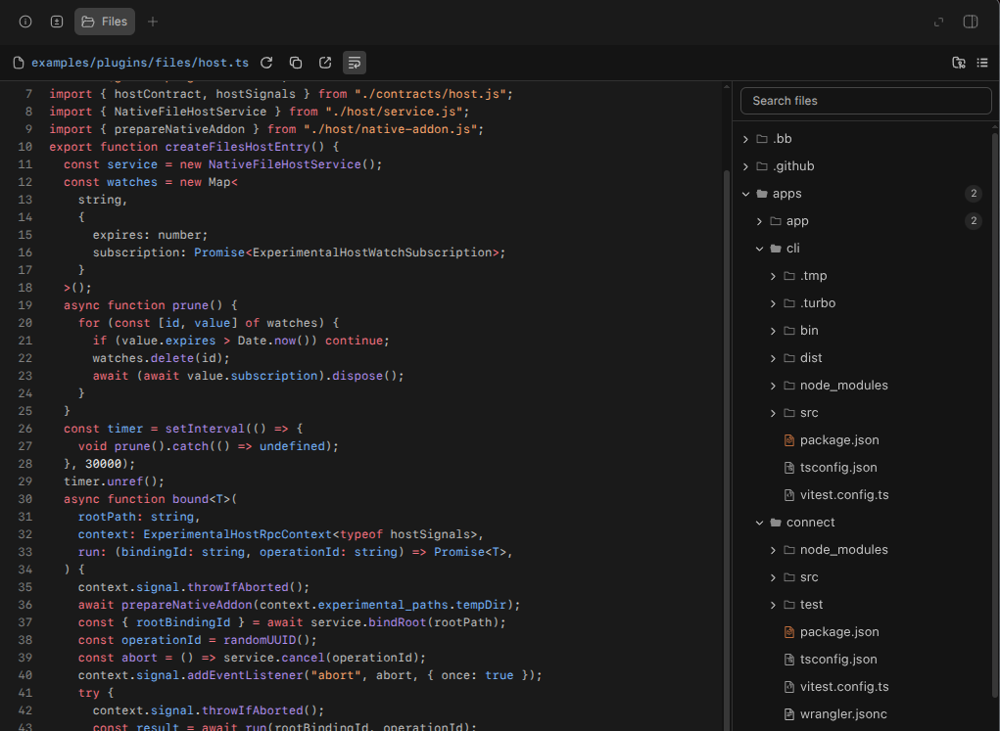

# Files

A Codex-style file pane for BB.



- Browse workspaces and project sources with search, Git status and live updates.
- Preview code, Markdown, images, PDF, HTML, Word, Excel and PowerPoint.
- Wrap text, copy paths or contents, download files and open your editor.

Opens supported files automatically. Or choose **+ → Files** in the right panel. File access is read-only.

```sh
bb plugin install https://github.com/wy3z/bb-plugin-filetree
```

Requires BB 0.42+. Includes a Linux x64 build; macOS requires a native build. Windows is unsupported.

[Development and CLI](docs/development.md)
